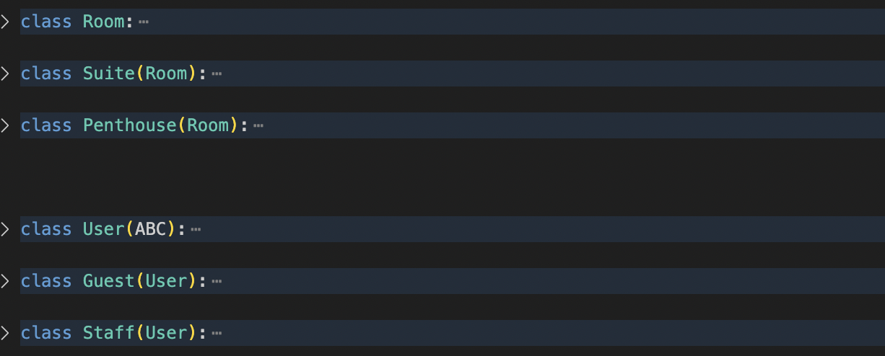

# Hotel Management System Coursework

## 1. Introduction

This is a hotel management application used to create, store reservations, protect against overlapping reservations. The abstract hotel used in this project has classes for hotel rooms, visitors, staff workers and other. To run this program, you need to go to this link: https://github.com/Arturas-Dg/hotel-management-system.git and either clone the repository onto a local device, or download the zip file from Github. Then, you should go the src folder, open main.py file and press run python file. If successful, the terminal will pop up and you should see messages of reserved rooms by imaginary guests and workers. 

## 2. Body / Analysis

There were several requirements for this assignment:
1. Implement the 4 pillars of OOP: 
- Inheritance
- Encapsulation
- Abstraction
- Polymorphism
2. Implement a design pattern
3. Implement composition and aggregation
4. Implement reading and writing to a file

This program fully satisfies the requirements, and further down below each of them it is explained how it was done so.

1. Implementation of 4 pillars of OOP.

# Inheritance

Inheritance has been achieved by creating a parent class Room, and then creating child classes Suite, Penthouse and Standard, which inherit from the Room class. The same principle is used with the parent class User, from which two child classes Guest and Staff are derived, use its methods and attributes. 

