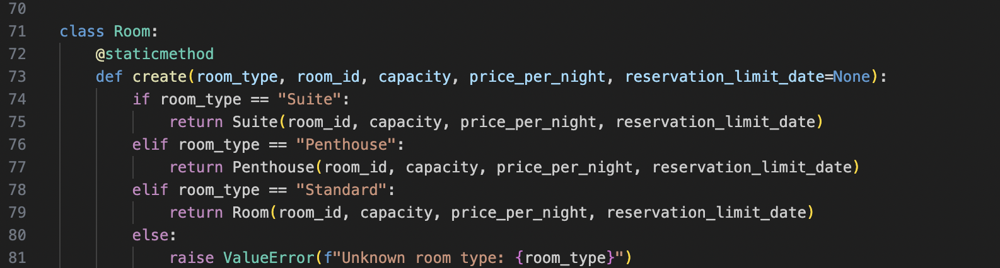

# Hotel Management System Coursework

## 1. Introduction

This is a hotel management application used to create and store reservations,
and protect against overlapping bookings. The system includes classes for hotel
rooms, guests, staff workers and more. To run this program, go to:
https://github.com/Arturas-Dg/hotel-management-system.git and either clone the
repository onto a local device, or download the ZIP file from GitHub. Then go
to the src folder, open main.py and press "Run Python File". If successful, the
terminal will display messages of reservations made by guests, blocked overlaps,
CSV saving and loading, and staff price verification.

## 2. Body / Analysis

There were several requirements for this assignment:
1. Implement the 4 pillars of OOP:
   - Inheritance
   - Encapsulation
   - Abstraction
   - Polymorphism
2. Implement a design pattern
3. Implement composition and aggregation
4. Implement reading and writing to a file

This program fully satisfies all requirements, explained in detail below.

### Inheritance

Inheritance has been achieved by creating a parent class `Room`, and then
creating child classes `Suite` and `Penthouse`, which inherit from it. The same
principle is used with the parent class `User`, from which two child classes
`Guest` and `Staff` are derived, reusing its structure and methods.

### Encapsulation

Encapsulation means hiding an object's internal data and controlling access to
it through methods. In this program, the `Room` class has a private variable
`_price`, which cannot be freely changed from outside the class. Access is
controlled through `get_price()` and `set_price()`, which only allow a Manager
to read or modify the price.

### Abstraction

Abstraction means defining what an object must do, without specifying how it
does it. In this program, `User` is an abstract class that cannot be
instantiated directly. It forces all subclasses to implement the `get_role()`
method, without defining how that method works itself.

### Polymorphism

Polymorphism means the same method can produce different behaviour depending
on the object it is called on. This program uses subtype polymorphism, where
subclasses override methods inherited from a parent class. This is demonstrated
through `get_role()` in `Guest` and `Staff`, and through `set_price()` across
`Room`, `Suite` and `Penthouse` — the same method call produces different
results depending on which room type it is called on.

### Design Pattern

The Factory Method pattern was chosen for this project. Instead of creating
room objects directly, a static `create()` method on the `Room` class handles
object creation based on a type string. The caller only specifies what type of
room is needed, without knowing the concrete class being instantiated.

This was the correct choice because it allows new room types to be added in the
future by only creating a new subclass and updating `Room.create()`, without
modifying any other part of the program. Other patterns were considered but
not suitable — Singleton would not work as multiple room instances are needed,
and Builder would be unnecessary as rooms do not require complex step-by-step
construction.

### Composition and Aggregation

Composition is demonstrated through the `Hotel` class, which owns and manages
lists of `Room` objects and reservations. The hotel cannot function meaningfully
without its rooms. Aggregation is shown in the reservation system, where each
reservation links an independent `Guest` object and a `Room` object together —
both exist independently but are associated through the reservation.

![screenshot of Hotel __init__]

## 3. Results and Summary

- The program successfully handles room reservations, blocking overlapping
  bookings and enforcing reservation limit dates.
- CSV saving and loading works correctly, allowing reservation data to persist
  between program runs.
- Access control is enforced — only a Manager can view or modify room prices.
- A challenge during implementation was ensuring loaded reservations from CSV
  correctly matched existing room objects in memory.
- Future extensions could include a login system for guests and staff, a
  graphical interface, or a database instead of CSV for more robust storage.

## 4. Conclusions

This project successfully implements a hotel management system that demonstrates
all four pillars of object-oriented programming, the Factory Method design
pattern, composition and aggregation, and file persistence through CSV. The
program correctly handles real-world scenarios such as overlapping reservation
prevention and role-based access control. In the future, the system could be
extended with a proper database, a user interface, or additional room types and
staff roles.